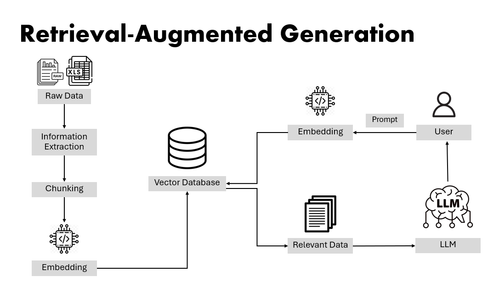

# Enterprise RAG Knowledge Base API

**ระบบค้นหาและตอบคำถามจากเอกสารภายในองค์กรด้วย AI**

**Project Overview:**

ระบบค้นหาและตอบคำถามจากเอกสารภายในองค์กรด้วย AI RAG (Retrieval-Augmented Generation ระบบนี้ช่วยให้พนักงานสามารถค้นหาข้อมูลจากคู่มือการทำงาน （PDF/Text） ที่ซับซ้อนได้อย่างรวดเร็ว โดย ใช้เทคนิค RAG (Retrieval-Augmented Generation) ผสานการทำงานระหว่าง Vector Database และ Large Language Model (LLM) เพื่อสรุปคำตอบที่แม่นยำและอ้างอิงแหล่งที่มาได้

**Tech Stack:**

- **Language:** Python, JavaScript
- **Core Framework:** FastAPI (Asynchronous API)
- **Database:** PostgreSQL + pgvector (Vector Store สำหรับการค้นหา Semantic Search)
- **AI/ML:**
  - **LLM:** Ollama (Qwen Model) สำหรับการสรุปและสร้างคำตอบ
  - **Embedding:** Sentence-Transformers (`intfloat/multilingual-e5-large`)
- **Libraries:** PyPDF2, Pydantic, Psycopg2
- **Tools:** Postman, React

**Key Features:**

**1. Smart Data Ingestion**

ไม่ใช่แค่อัปโหลดไฟล์แล้วจบ แต่ผมเขียนระบบให้มัน "อ่านและคลีน" ข้อมูลก่อนเก็บครับ

- **รับไฟล์ได้หลายแบบ:** ทั้ง PDF และ Text ธรรมดา
- **คลีนข้อมูลขยะอัตโนมัติ:** เขียน Logic ดักจับพวกเลขหน้า, หัวกระดาษซ้ำๆ หรือสระลอยในภาษาไทย เพื่อให้ข้อมูลสะอาดที่สุดก่อนส่งให้ AI อ่าน
- **แบ่งเนื้อหาอย่างฉลาด (Chunking):** หั่นเนื้อหายาวๆ เป็นท่อนเล็กๆ โดยมีการทับซ้อนกันนิดหน่อย (Overlap) เพื่อให้ AI อ่านแล้วไม่สะดุด เข้าใจบริบทต่อเนื่อง

**2. Semantic Search**

- **ไม่ได้หาแค่ตามตัวอักษร:** ใช้ระบบ Vector Search ที่เข้าใจ "ความหมาย" ของคำ เช่น พิมพ์ว่า "วิธีส่งของ" ก็ไปเจอข้อมูลเรื่อง "Delivery Order" ได้
- **เข้าใจศัพท์เทคนิค (Jargon Handling):** ผมทำระบบแปลงคำย่ออัตโนมัติ เช่น พิมพ์ "SA" ระบบจะรู้ทันทีว่าหมายถึง "Sale Agreement" ทำให้หาข้อมูลเจอแม่นยำขึ้น แม้ user จะพิมพ์สั้นๆ

**3. Robust & Scalable Architecture (สถาปัตยกรรมที่รองรับการขยายตัว)**

- **แยกส่วนชัดเจน (Clean Architecture):** แบ่งโค้ดเป็นสัดส่วน (API, Logic, Database) ทำให้แก้บั๊กง่ายและเพิ่มฟีเจอร์ใหม่ได้สะดวก
- **ทำงานไว ไม่ค้าง (Async Performance):** ใช้เทคนิค Asynchronous จัดการงานหนักๆ อย่างการประมวลผลไฟล์ ทำให้ระบบยังตอบสนองได้ไวแม้จะมีคนใช้งานพร้อมกัน
- **จัดการฐานข้อมูล:** มีระบบ Connection Pooling ช่วยให้เชื่อมต่อฐานข้อมูลได้เร็วและเสถียร

**4. Security & Observability**

- **API Key Authentication:** ระบบป้องกันการเข้าถึง API ด้วย Key
- **Comprehensive Logging:** บันทึกการทำงานและ Error ทั้งหมดลงไฟล์ Log เพื่อการตรวจสอบย้อนหลัง
