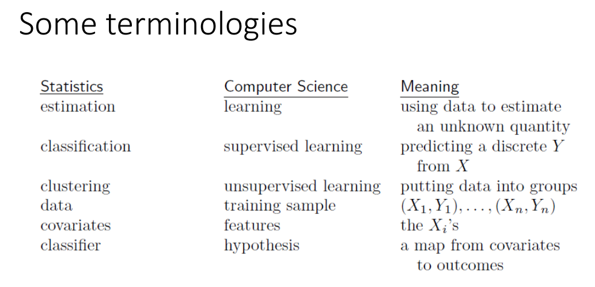

# Intro to statistics for data science, describing data, variation

**Type**

- **Descriptive** (mean, mode, quantiles)
    - Table
    - Report
    - Dashboard
- **Inferential** (sample, Hypo)
    - Hypothesis
    - Regression Model

---

---

**Inferential** 
Population == Random ⇒ Sample

- Treatment Group
- Control Group

